# 🔍 InsightLens AI


## Multimodal Visual Intelligence Assistant Powered by Gemini Vision

InsightLens AI is a production-style Generative AI application that enables users to interact with images using natural language. Built with Google Gemini Vision and Streamlit, the application allows users to upload images, ask questions, generate insights, create study notes, generate quizzes, and analyze visual content through a modern, interactive interface.

---

## 🚀 Project Overview

InsightLens AI transforms traditional Visual Question Answering (VQA) into a recruiter-ready multimodal AI application.

Users can:

* Upload images
* Ask natural language questions
* Generate image summaries
* Extract insights
* Create study notes
* Generate quiz questions
* Analyze charts and diagrams
* Download AI-generated responses
* Track usage statistics and token consumption

---

## ✨ Key Features

### 🤖 Gemini Vision Integration

* Google Gemini Vision-powered image understanding
* Multimodal image and text processing
* Natural language interaction

### 🖼️ Image Analysis

* Upload JPG, JPEG, and PNG images
* Preview uploaded images
* Ask contextual questions

### 🧠 AI Assistant Prompts

Built-in prompt templates:

* Describe Image
* What Objects Are Visible?
* Summarize Image
* Create Study Notes
* Extract Key Insights
* Generate Quiz Questions
* Explain Chart

### 📜 History Tracking

* Stores previous interactions
* Review past questions and responses
* Session-based memory management

### 📥 Download Responses

* Export generated responses
* Save insights for future reference

### 📊 Token Monitoring

* Prompt Tokens
* Response Tokens
* Total Tokens
* Estimated Usage Cost
* User-controlled token limits

### 🏗 Architecture Documentation

Includes:

* User Flow Architecture
* Developer Flow Architecture
* Enterprise Flow Architecture
* Enterprise Roadmap

---

## 🏛 System Architecture

### 👤 User Flow Architecture
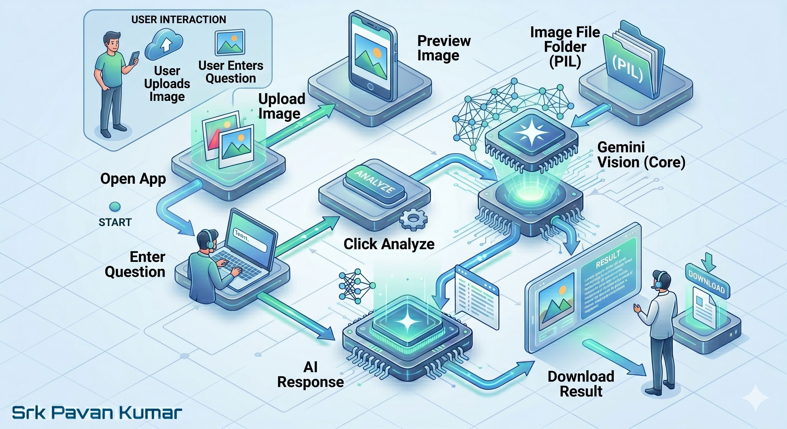

---

### ⚙ Developer Flow Architecture
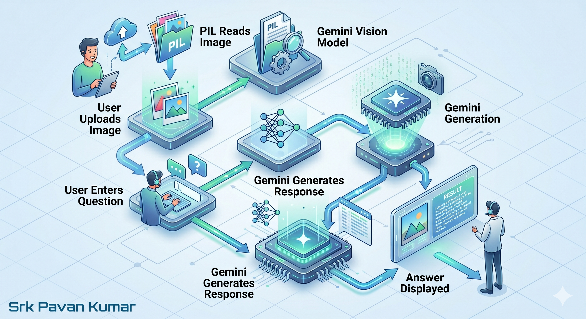
---

### 🏢 Enterprise Flow Architecture
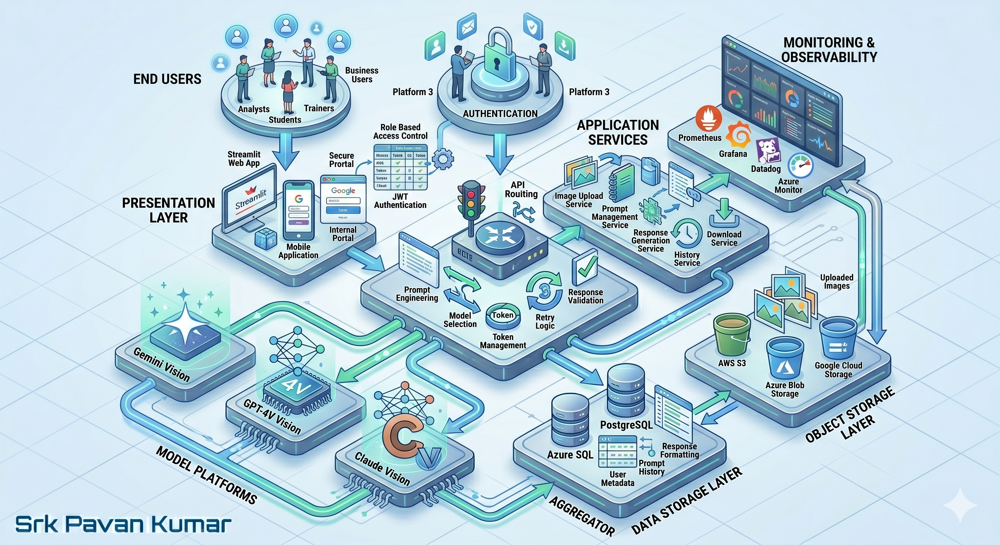

---

### 🏗 Enterprise Architecture Structure
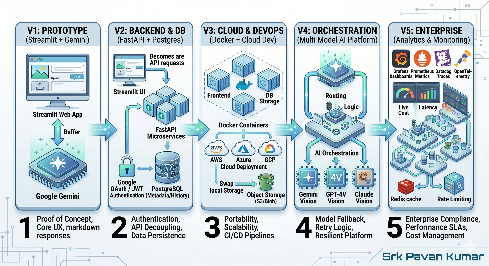

---

## 🛠 Tech Stack

| Category               | Technology           |
| ---------------------- | -------------------- |
| Frontend               | Streamlit            |
| AI Model               | Google Gemini Vision |
| Programming Language   | Python               |
| Image Processing       | Pillow (PIL)         |
| Data Storage           | JSON                 |
| Environment Management | Python Dotenv        |
| Documentation          | Markdown             |
| Version Control        | Git & GitHub         |

---

## 📁 Project Structure

```text
InsightLens-AI/
│
├── app.py
│
├── pages/
│   ├── 1_🏠_Home.py
│   ├── 2_🏗_Architecture.py
│   ├── 3_🤖_Image_Bot.py
│   └── 4_📜_History.py
│
├── src/
│   ├── config.py
│   ├── storage.py
│   ├── gemini_helper.py
│   └── utils.py
│
├── architecture/
│   ├── user_flow.png
│   ├── developer_flow.png
│   ├── enterprise_flow.png
│   └── enterprise_structure.png
│
├── screenshots/
│   ├── light-theme/
│   └── dark-theme/
│
├── data/
│   └── history.json
│
├── requirements.txt
├── .gitignore
├── .env.example
└── README.md
```

---

### 🌞 Light Theme

## 📸 Application Screenshots
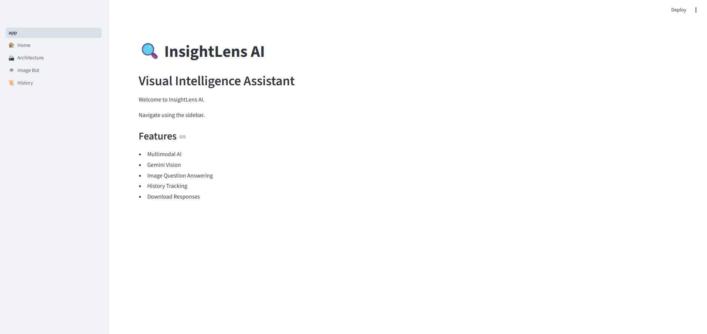

#### 🏠 Home Page
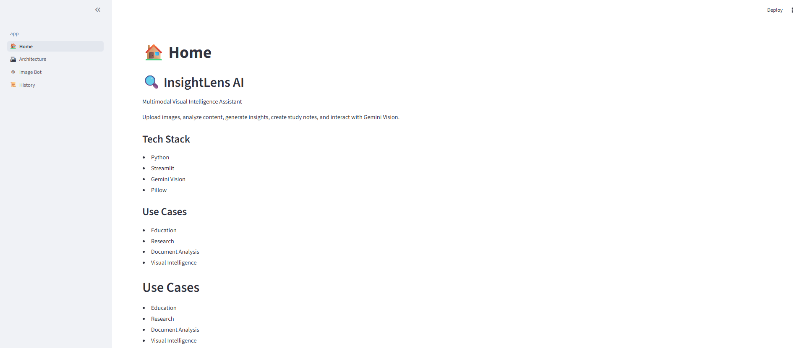
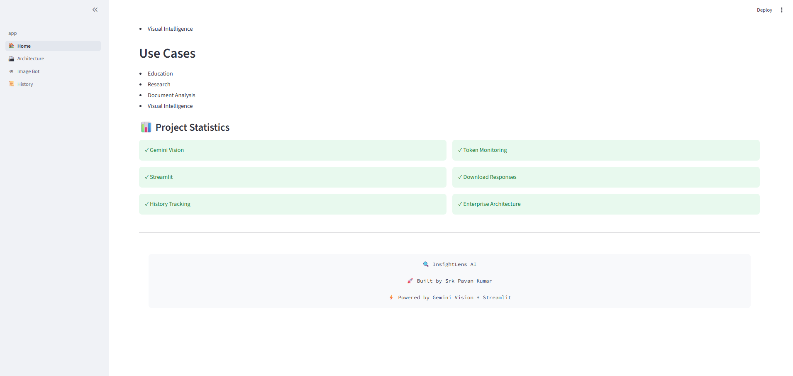

#### 🏗 Architecture Page
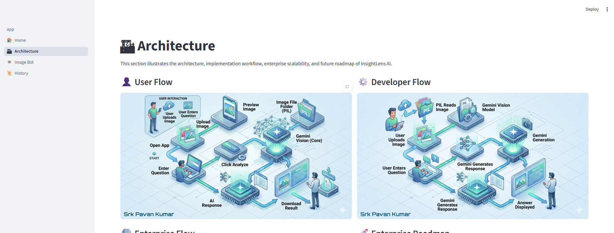
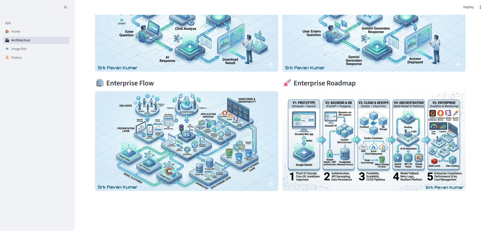

#### 🤖 Image Bot
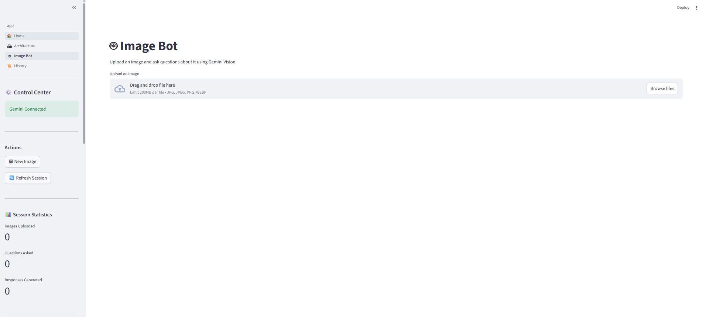
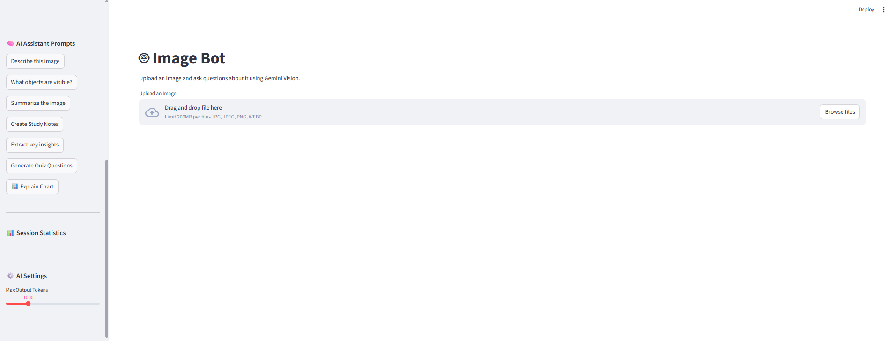
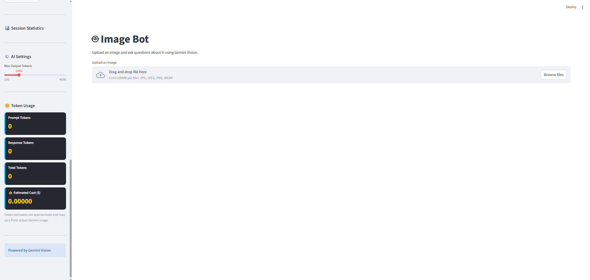

#### 📜 History Page
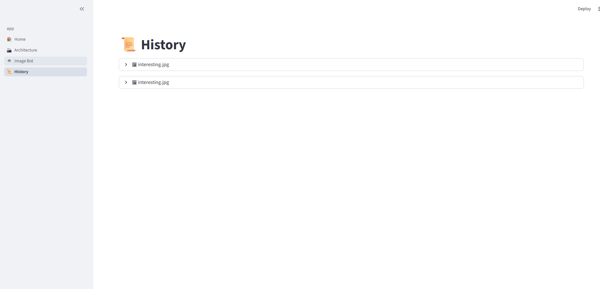
---

### 🌙 Dark Theme

## 📸 Application Screenshots
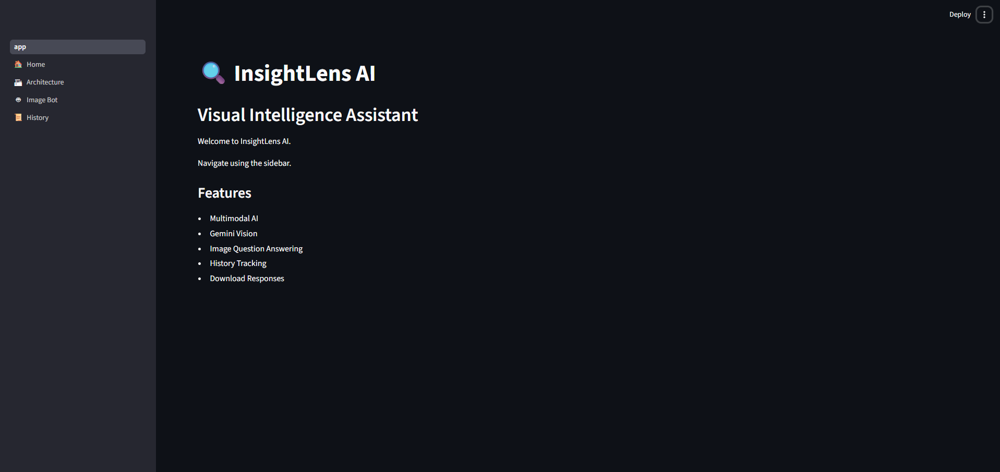

#### 🏠 Home Page
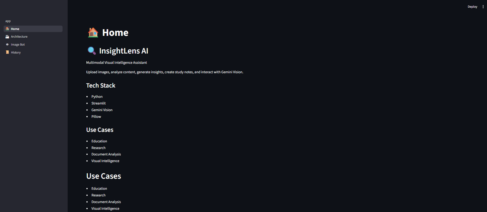
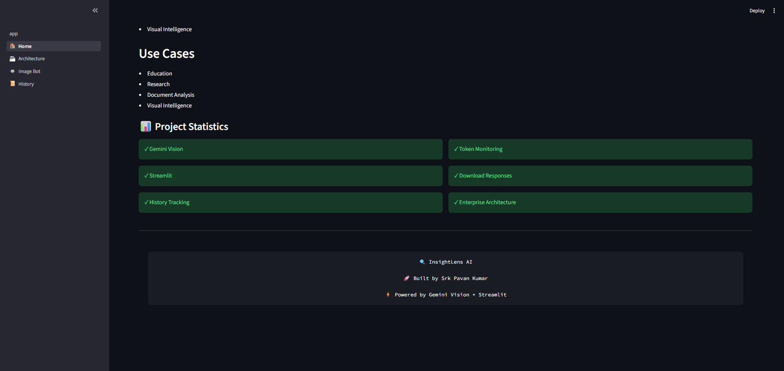

#### 🏗 Architecture Page
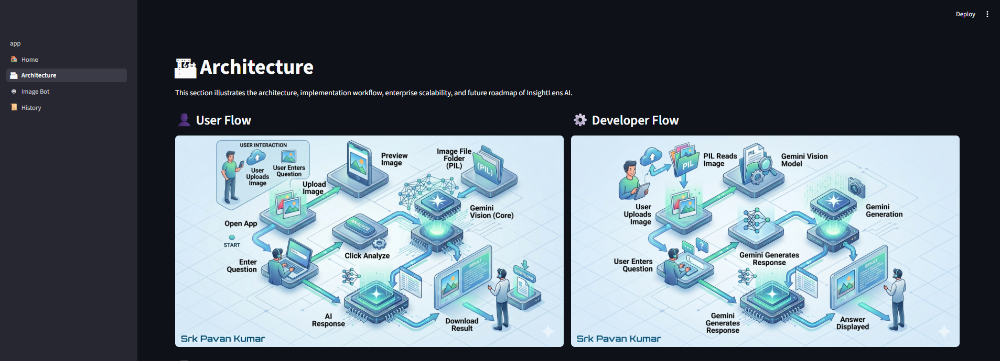
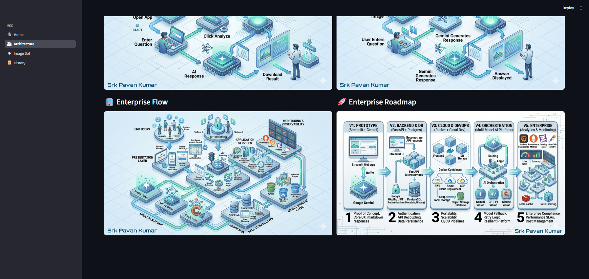

#### 🤖 Image Bot
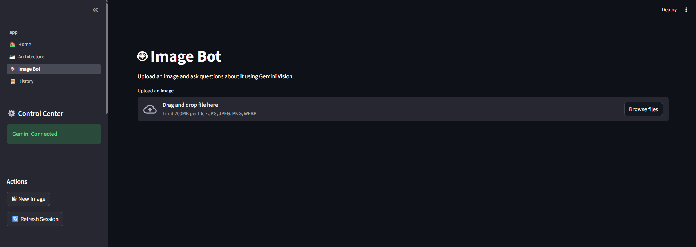
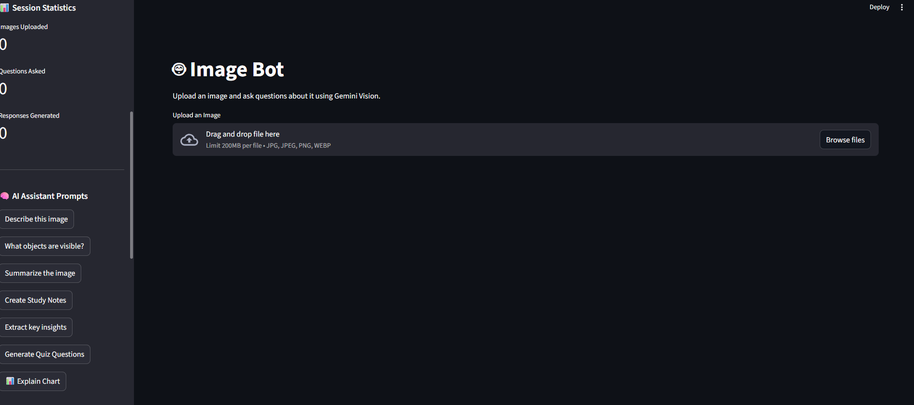
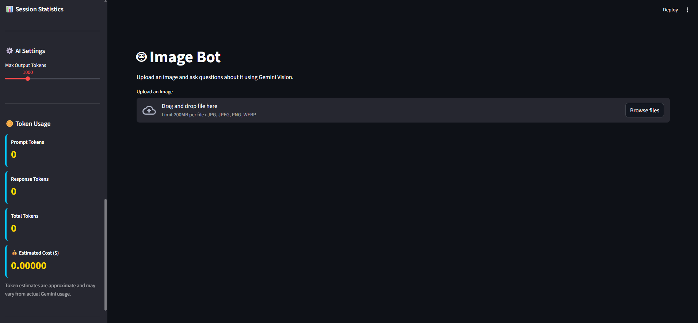

#### 📜 History Page
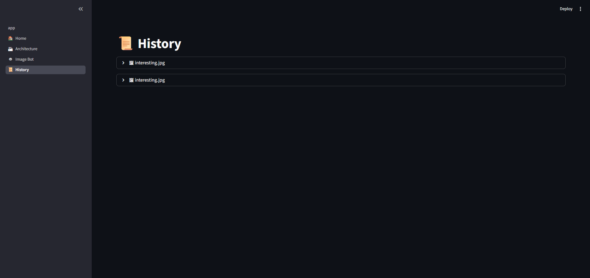

---

> **Note:** Ensure the screenshot filenames match the paths shown above. Update the filenames if your screenshots use different names.

---

## ⚙ Installation

### Clone Repository

```bash
git clone https://github.com/your-username/InsightLens-AI.git
```

```bash
cd InsightLens-AI
```

---

### Create Virtual Environment

```bash
python -m venv venv
```

Activate:

```bash
venv\Scripts\activate
```

---

### Install Dependencies

```bash
pip install -r requirements.txt
```

---

### Configure Environment Variables

Create a `.env` file:

```env
GOOGLE_API_KEY=YOUR_GEMINI_API_KEY
```

---

### Run Application

```bash
streamlit run app.py
```

---

## 🎯 Business Use Cases

### Education

* Visual learning assistance
* Study note generation
* Quiz creation

### Research

* Image-based content understanding
* Diagram interpretation
* Knowledge extraction

### Analytics

* Chart analysis
* Visual insight generation
* Report interpretation

### Enterprise

* Document intelligence
* Knowledge management
* Visual AI assistants

---

## 🚀 Future Roadmap

### Version 2.0

* FastAPI Backend
* PostgreSQL Database
* User Authentication

### Version 3.0

* Docker Containerization
* Cloud Deployment
* CI/CD Pipeline

### Version 4.0

* Multi-Model Support

  * Gemini Vision
  * GPT-4 Vision
  * Claude Vision

### Version 5.0

* Enterprise Monitoring
* Redis Caching
* Analytics Dashboard
* Rate Limiting
* Role-Based Access Control

---

## 💡 Learning Outcomes

This project demonstrates:

* Multimodal AI Development
* Generative AI Application Design
* Prompt Engineering
* Streamlit Development
* Google Gemini Vision Integration
* Enterprise Architecture Thinking
* Product-Oriented Development
* GitHub Portfolio Preparation

---

## 👨‍💻 Author

### Srk Pavan Kumar

AI Enthusiast | GenAI Learner | Solution Architecture Explorer

Built as part of a portfolio journey focused on transforming AI concepts into production-style applications.

---

## ⭐ Support

If you found this project helpful, consider giving it a star on GitHub.

Your support helps improve and expand future AI projects.
